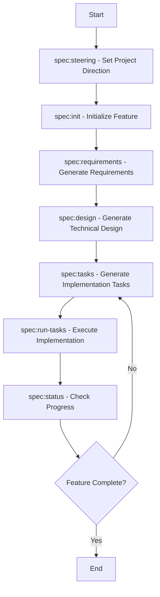
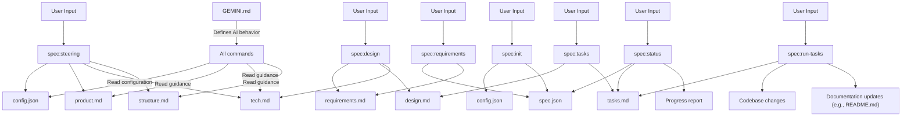
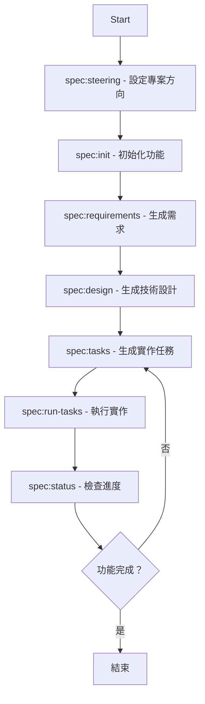
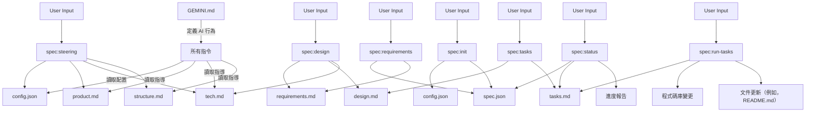

# Gemini Spec-Driven Dev Template

> 🌐 **Language**: [English](#english) | [繁體中文](#繁體中文)

---

## English

### Quick Start

To get started with the Gemini Spec-Driven Dev Template, follow these steps:

1. **Integrate into Your Project**
   Copy the `.gemini/`, `.kiro/`, `GEMINI.md`, and `README.md` (this file) from this template into the root directory of your target project.

2. **(Optional) Configure Workflow**
   Edit `.kiro/config.json` to set your preferred `approval_mode` (e.g., `"implicit"` for streamlined, or `"interactive"` for explicit confirmation).

3. **Launch Gemini in Your Project Directory**
   From your project's root directory, launch Gemini via the terminal.

   ```bash
   gemini
   ```

4. **Set Project Language and Initial Steering**
   Run the recommended first step for any new project. This command initializes or updates the project's high-level goals and architecture, including setting the default language.

   ```bash
   /spec:steering
   ```

5. **Initialize Your First Feature**
   Start your first feature specification by providing a detailed description. This creates the necessary directory structure and metadata files.

   ```bash
   /spec:init "A detailed description of the feature you want to build."
   ```

---

## Table of Contents

* [Gemini Spec-Driven Dev Template](#gemini-spec-driven-dev-template)
  * [English](#english)
    * [Quick Start](#quick-start)
  * [Table of Contents](#table-of-contents)
    * [Project Overview](#project-overview)
    * [The Role of `GEMINI.md` and Multilingual Interaction](#the-role-of-geminimd-and-multilingual-interaction)
    * [Configurable Workflow](#configurable-workflow)
    * [Template Structure](#template-structure)
    * [Step-by-Step Guide](#step-by-step-guide)
    * [Effective Use of Examples](#effective-use-of-examples)
    * [Best Practices](#best-practices)
    * [Document and Configuration Relationships](#document-and-configuration-relationships)
    * [Functional Comparison with `claude-code-spec`](#functional-comparison-with-claude-code-spec)
  * [繁體中文](#繁體中文)
    * [快速開始](#快速開始)
    * [專案簡介](#專案簡介)
    * [`GEMINI.md` 的角色與多語言互動](#geminimd-的角色與多語言互動)
    * [可配置的工作流程](#可配置的工作流程)
    * [模板結構](#模板結構)
    * [步驟指南](#步驟指南)
    * [有效使用範例](#有效使用範例)
    * [最佳實踐](#最佳實踐)
    * [文件與配置關係](#文件與配置關係)
    * [各階段功能及與 `claude-code-spec` 的差異](#各階段功能及與-claude-code-spec-的差異)

---

### Project Overview

This project, gemini-spec-driven-dev-template, is a re-implementation and adaptation of the powerful spec-driven
development workflow from the claude-code-spec project, brought into the Gemini CLI ecosystem. Our goal is to replicate
that seamless, automated, and reliable development process using the native capabilities of the Gemini CLI, particularly
its custom commands and tool execution features.

As a starter kit and a powerful extension for the Gemini CLI, this template provides a structured, command-driven
workflow for software development. It guides you from a high-level feature idea to a detailed, and now executable,
implementation plan (via the new /spec:run-tasks command) through a series of automated steps. This ensures
consistency, quality, and clear documentation throughout the development lifecycle.

* Inspired by: [claude-code-spec](https://github.com/gotalab/claude-code-spec)

---

### The Role of `GEMINI.md` and Multilingual Interaction

This template includes a GEMINI.md file, which acts as the central brain for the AI agent. It contains a detailed set
of instructions that define the agent's behavior, workflow, and logic.

A key feature of this logic is multilingual support. The recommended entry point for language configuration is now the
/spec:steering command, which sets the project's default language stored in .kiro/config.json. All subsequent commands,
including /spec:init, will automatically read and use this setting to maintain consistent multilingual interactions.

---

### Configurable Workflow

This template now supports both implicit and interactive approval workflows. You can switch between them by editing the
.kiro/config.json file.

* `"approval_mode": "implicit"` (Default): The original, streamlined workflow where running the next command (e.g.,
  /spec:design) automatically approves the previous stage.
* `"approval_mode": "interactive"`: A more deliberate workflow where the agent will ask for your explicit [y/N]
  confirmation before proceeding to the next stage, similar to the original claude-code-spec.

---

### Template Structure

This template provides a structured environment for spec-driven development. Here's an overview of the key directories
and files:

```bash
gemini-spec-driven-dev-template/
├── .gemini/                     # Gemini CLI commands and scripts
│   ├── commands/                # Custom commands (e.g., /spec:init, /spec:design)
│   └── scripts/                 # Helper scripts (e.g., calculate_progress.py)
├── .kiro/                       # Specification files and configuration
│   ├── config.json              # Workflow configuration (e.g., approval_mode, language)
│   ├── specs/                   # Generated specification documents for features
│   │   └── [feature-name]/      # Feature-specific directory
│   │       ├── requirements.md  # Feature requirements
│   │       ├── design.md        # Technical design
│   │       ├── tasks.md         # Implementation tasks
│   │       └── spec.json        # Feature metadata
│   └── steering/                # Project-wide steering documents
│       ├── product.md           # Product goals and vision
│       ├── tech.md              # Technical standards and decisions
│       └── structure.md         # Project structure guidelines
├── example/                     # Example projects demonstrating the workflow
│   └── blog-post-generator/     # A complete, functional example project
├── GEMINI.md                    # Core instructions and behavior for the Gemini agent
├── README.md                    # This document
└── ...                          # Other project files (e.g., .gitignore, CHANGELOG.md)
```

---

### Step-by-Step Guide

Follow this sequence to develop a feature from scratch using the Gemini Spec-Driven Dev Template:

#### Workflow Overview



#### Command Reference

| Command | Purpose | Common Timing |
|---|---|---|
| `/spec:steering` | Establishes or updates the project's high-level goals, architecture, and structure, including setting the default language. | First step for any new project. |
| `/spec:init` | Creates the necessary directory structure and metadata files for a new feature. | When starting a new feature. |
| `/spec:requirements` | Generates the `requirements.md` file based on the initial feature description. | After initializing a feature. |
| `/spec:design` | Implicitly approves requirements and generates the `design.md` file. | After reviewing and approving requirements. |
| `/spec:tasks` | Implicitly approves design and generates a detailed `tasks.md` file with a TDD-style checklist for implementation. | After reviewing and approving the design. |
| `/spec:run-tasks` | Automatically executes the coding tasks defined in `tasks.md`, writing and modifying files to build the feature. | When ready to implement the feature. |
| `/spec:status` | Provides a full report on the feature's progress, including automated task completion percentage. | At any point to check progress. |

#### Phase 1: Steering & Initialization

* **0. Set Project Direction (`/spec:steering`)**: This initial command is crucial for defining the project's overarching goals and technical foundation. For new projects, it prompts for a high-level description and generates initial steering documents, also setting the project's default language.

* **0.1. Custom Steering (`/spec:steering-custom`) (Optional)**: Use this command to create specialized steering documents for specific contexts, such as API standards or testing methodologies.

* **1. Initialize Feature (`/spec:init`)**: This command sets up the necessary directory structure and metadata files for your new feature, automatically incorporating the project's language setting.

#### Phase 2: Specification Development

* **2. Generate Requirements (`/spec:requirements`)**: This command generates the `requirements.md` file, outlining the feature's functional and non-functional needs. Review this document carefully before proceeding.

* **3. Generate Design (`/spec:design`)**: This command implicitly approves the requirements and generates the `design.md` file, detailing the technical architecture and solutions. It incorporates best practices and updates project-wide technical standards.

* **4. Generate Tasks (`/spec:tasks`)**: This command implicitly approves the design and generates a detailed `tasks.md` file, providing a TDD-style checklist for the implementation phase.

#### Phase 3: Implementation & Verification

| Command | Action |
|---|---|
| `/spec:run-tasks [feature-name]` | Automatically executes the coding tasks defined in `tasks.md`, writing and modifying files to build the feature. It now also automatically generates and writes related documentation files as needed (e.g., updating README.md). |
| `/spec:status [feature-name]` | At any point, run this command to get a full report on the feature's progress. The report now includes a specific, runnable next command to guide you. |

---

### Effective Use of Examples

The example/ directory is crucial for success. The AI programming assistant performs significantly better when it can
see patterns to follow.

This template includes a fully functional and completed sample project located at:

```bash
example/blog-post-generator/
```

This project demonstrates a complete spec-driven development workflow. For detailed information and usage instructions,
please refer to the README.md file in the example project directory.

#### How to Leverage the Example Project

* **Explore**: Navigate through `example/blog-post-generator/` to understand a complete spec-driven project from requirements
    (`.kiro/specs/blog-post-generator/requirements.md`) to implementation (`src/`).
* **Learn Patterns**: Observe how the code adheres to best practices and project conventions.
* **Replicate**: Use the example as a blueprint for your own features. You can copy its structure and adapt it.
* **Test Drive**: Run the example's tests (`pytest` from `example/blog-post-generator/`) to see a working implementation.

---

### Best Practices

* **Follow the Workflow**: Adhere to the `init` -> `requirements` -> `design` -> `tasks` sequence for consistent results.
* **Steer First**: Run `/spec:steering` for new projects to establish a clear foundation.
* **Review and Refine**: Manually review and edit generated documents (`requirements.md`, `design.md`, `tasks.md`) to ensure they align with your vision.
* **Leverage Examples**: Use the `example/` directory to understand best practices and provide the AI with clear patterns to follow.

---

### Document and Configuration Relationships

Understanding how different files and configurations interact is key to effectively using this template.

#### Document Relationship Diagram



* **`GEMINI.md`**: The core instruction file for the Gemini agent, defining its behavior, workflow, and logic. It is the agent’s “brain.”
* **`.kiro/config.json`**: Stores project-wide configurations, including approval_mode (implicit/interactive) and the default language for new features.
* **`.kiro/steering/`**: Contains project-level guidance documents (product.md, tech.md, structure.md) defining the project’s vision, technical standards, and architecture guidelines. These are your project’s “constitution.”
* **`.kiro/specs/[feature-name]/`**: This directory contains all generated specification files (requirements.md, design.md, tasks.md) and metadata (spec.json) for a specific feature. These are your feature’s “blueprints.”
* **`example/`**: Contains fully functional example projects demonstrating the spec-driven workflow and providing the AI with learnable code patterns.

---

## Functional Comparison with `claude-code-spec`

### Progress Tracking

* `claude-code-spec`: Uses event-driven **Hooks** to automatically trigger progress updates in the background after a file is modified. This is a **proactive, push-based** system.
* This Project (Gemini): Implements progress tracking via the `/spec:status` command. When executed, it calls a Python script (`calculate_progress.py`) on-demand to calculate progress without modifying `spec.json`, presenting the real-time status directly.

### Spec Drift Detection

* `claude-code-spec`: Relies on Hooks to trigger LLM analysis in the background when source code changes, providing real-time feedback.
* This Project (Gemini): This feature is not yet supported.

---

## 繁體中文

### 快速開始

要開始使用 Gemini 規格驅動開發範本，請遵循以下步驟：

1. **整合到您的專案中**
   將 `.gemini/`、`.kiro/`、`GEMINI.md` 和 `README.md`（此檔案）從此範本複製到您的目標專案的根目錄。

2. **（可選）配置工作流程**
   編輯 `.kiro/config.json` 以設定您偏好的 `approval_mode`（例如，`"implicit"` 用於簡化，或 `"interactive"` 用於明確確認）。

3. **於專案目錄啟動Gemini**
   透過終端機，從您的目標專案的根目錄啟動 Gemini。

   ```bash
   gemini
   ```

4. **設定專案語言和初始指導**
   運行任何新專案的推薦第一步。此命令初始化或更新專案的高層次目標和架構，包括設定預設語言。

   ```bash
   /spec:steering
   ```

5. **初始化您的第一個功能**
   透過提供詳細描述來啟動您的第一個功能規格。這將創建必要的目錄結構和元數據檔案。

   ```bash
   /spec:init "在這裡詳細描述您想建立的功能。"
   ```

---

### 專案簡介

本專案 `gemini-spec-driven-dev-template` 是 `claude-code-spec` 專案中強大規格驅動開發工作流程的重新實現和改編，並將其引入 Gemini CLI 生態系統。我們的目標是利用 Gemini CLI 的原生功能，特別是其自訂命令和工具執行功能，來複製那種無縫、自動化和可靠的開發過程。

作為 Gemini CLI 的入門套件和強大擴展，此範本提供了一個結構化的、命令驅動的軟體開發工作流程。它引導您從高層次的功能構想，透過一系列自動化步驟，產出一個詳細且現在可執行的實作計畫（透過新的 `/spec:run-tasks` 命令）。這確保了整個開發生命週期中的一致性、品質和清晰的文件。

* 靈感來源：[claude-code-spec](https://github.com/gotalab/claude-code-spec)

---

### `GEMINI.md` 的角色與多語言互動

此範本包含一個 `GEMINI.md` 檔案，它充當 AI 代理的核心大腦。它包含一組詳細的指令，定義了代理的行為、工作流程和邏輯。

此邏輯的一個關鍵特性是多語言支援。語言配置的推薦入口點現在是 `/spec:steering` 命令，它設定並儲存專案的預設語言到 `.kiro/config.json`。所有後續命令，包括 `/spec:init`，都將自動讀取並使用此設定以保持一致的多語言互動。

---

### 可配置的工作流程

此範本現在支援隱式和互動式兩種審批工作流程。您可以透過編輯 `.kiro/config.json` 檔案來切換它們。

* `"approval_mode": "implicit"` (預設)：原始的、簡化的工作流程，運行下一個命令（例如 `/spec:design`）會自動批准上一個階段。
* `"approval_mode": "interactive"`：一個更深思熟慮的工作流程，代理將在進入下一個階段之前，要求您明確的 `[y/N]` 確認，類似於原始的 `claude-code-spec`。

---

### 模板結構

此範本為規格驅動開發提供了一個結構化的環境。以下是關鍵目錄和檔案的概述：

```bash
gemini-spec-driven-dev-template/
├── .gemini/                     # Gemini CLI 命令和腳本
│   ├── commands/                # 自訂命令（例如，/spec:init, /spec:design）
│   └── scripts/                 # 輔助腳本（例如，calculate_progress.py）
├── .kiro/                       # 規格檔案和配置
│   ├── config.json              # 工作流程配置（例如，approval_mode, language）
│   ├── specs/                   # 為功能生成的規格文件
│   │   └── [feature-name]/      # 功能特定目錄
│   │       ├── requirements.md  # 功能需求
│   │       ├── design.md        # 技術設計
│   │       ├── tasks.md         # 實作任務
│   │       └── spec.json        # 功能元數據
│   └── steering/                # 專案範圍的指導文件
│       ├── product.md           # 產品目標和願景
│       ├── tech.md              # 技術標準和決策
│       └── structure.md         # 專案結構指南
├── example/                     # 演示工作流程的範例專案
│   └── blog-post-generator/     # 一個完整、功能齊全的範例專案
├── GEMINI.md                    # Gemini 代理的核心指令和行為
├── README.md                    # 此文件
└── ...                          # 其他專案檔案（例如，.gitignore, CHANGELOG.md）
```

---

### 步驟指南

請遵循以下順序，使用 Gemini 規格驅動開發範本從頭開始開發一個功能：

#### 工作流程概述



#### 指令參考

| 指令 | 用途 | 常見時機 |
|---|---|---|
| `/spec:steering` | 設定專案高層次目標、架構和結構，包括設定預設語言。 | 任何新專案的第一步。 |
| `/spec:init` | 為新功能建立必要的目錄結構和元數據檔案。 | 開發新功能時。 |
| `/spec:requirements` | 根據初始功能描述生成 `requirements.md` 檔案。 | 初始化功能後。 |
| `/spec:design` | 隱式批准需求並生成 `design.md` 檔案。 | 審閱並批准需求後。 |
| `/spec:tasks` | 隱式批准設計並生成帶有 TDD 風格檢查清單的詳細 `tasks.md` 檔案。 | 審閱並批准設計後。 |
| `/spec:run-tasks` | 自動執行 `tasks.md` 中定義的編碼任務，寫入和修改檔案以構建功能。 | 準備實作功能時。 |
| `/spec:status` | 提供功能進度的完整報告，包括自動化任務完成百分比。 | 隨時檢查進度。 |

#### 階段 1：指導與初始化

* **0. 設定專案方向 (`/spec:steering`)**: 此初始命令對於定義專案的總體目標和技術基礎至關重要。對於新專案，它會提示高層次描述並生成初始指導文件，同時設定專案的預設語言。

* **0.1. 自訂指導 (`/spec:steering-custom`) (可選)**: 使用此命令為特定情境（例如，API 標準、測試方法）建立專門的指導文件。

* **1. 初始化功能 (`/spec:init`)**: 此命令會為您的新功能建立必要的目錄結構和元數據檔案，並自動納入專案的語言設定。

#### 階段 2：規格開發

* **2. 生成需求 (`/spec:requirements`)**: 此命令會生成 `requirements.md` 檔案，概述功能的職能和非職能需求。在繼續之前請仔細審閱此文件。

* **3. 生成設計 (`/spec:design`)**: 此命令會隱式批准需求並生成 `design.md` 檔案，詳細說明技術架構和解決方案。它會整合最佳實踐並更新專案範圍的技術標準。

* **4. 生成任務 (`/spec:tasks`)**: 此命令會隱式批准設計並生成一個詳細的 `tasks.md` 檔案，為實作階段提供 TDD 風格的檢查清單。

#### 階段 3：實作與驗證

| 命令 | 作用 |
|---|---|
| `/spec:run-tasks [feature-name]` | 自動執行 `tasks.md` 中定義的編碼任務，寫入和修改檔案以構建功能。它現在還會自動生成和寫入相關的文件（例如，更新 `README.md`）。 |
| `/spec:status [feature-name]` | 在任何時候，運行此命令以獲取功能進度的完整報告。報告現在包含一個特定的、可運行的下一個命令來指導您。 |

---

### 有效使用範例

`example/` 目錄對於成功至關重要。當 AI 程式設計助理能夠看到要遵循的模式時，它的表現會顯著提高。

此範本包含一個功能齊全且已完成的範例專案，位於：

```bash
example/blog-post-generator/
```

此專案演示了一個完整的規格驅動開發工作流程。有關詳細資訊和使用說明，請參閱範例專案目錄中的 `README.md` 檔案。

#### 如何利用範例專案

* **探索**: 瀏覽 `example/blog-post-generator/` 以了解一個完整的規格驅動專案，從需求
    （`.kiro/specs/blog-post-generator/requirements.md`）到實作（`src/`）。
* **學習模式**: 觀察程式碼如何遵循最佳實踐和專案慣例。
* **複製**: 將範例作為您自己功能的藍圖。您可以複製其結構並進行調整。
* **測試驅動**: 運行範例的測試（來自 `example/blog-post-generator/` 的 `pytest`）以查看工作實作。

---

### 最佳實踐

* **遵循工作流程**: 嚴格遵守 `init` -> `requirements` -> `design` -> `tasks` 的順序，以確保結果的一致性。
* **先指導，後開發**: 對於新專案，首先運行 `/spec:steering`，建立清晰的基礎。
* **審查與優化**: 手動審查和編輯生成的文件（`requirements.md`, `design.md`, `tasks.md`），確保它們與您的願景一致。
* **善用範例**: 使用 `example/` 目錄來理解最佳實踐，並為 AI 提供清晰的模式以供遵循。

---

### 文件與配置關係

了解不同檔案和配置如何互動是有效使用此範本的關鍵。

#### 文件關係圖



* **`GEMINI.md`**: Gemini 代理的核心指令檔案，定義其行為、工作流程和邏輯。它是代理的「大腦」。
* **`.kiro/config.json`**: 儲存專案範圍的配置，包括 `approval_mode`（隱式/互動式）和新功能的預設 `language`。
* **`.kiro/steering/`**: 包含專案級別的指導文件（`product.md`、`tech.md`、`structure.md`），定義專案的願景、技術標準和架構指南。這些是您專案的「憲法」。
* **`.kiro/specs/[feature-name]/`**: 此目錄包含特定功能的所有生成的規格文件（`requirements.md`、`design.md`、`tasks.md`）和元數據（`spec.json`）。這些是您功能的「藍圖」。
* **`example/`**: 包含功能齊全的範例專案，演示規格驅動工作流程並為 AI 提供可學習的程式碼模式。

---

## 各階段功能及與 `claude-code-spec` 的差異

### 進度追蹤

* `claude-code-spec`: 使用事件驅動的 **Hooks**，在檔案被修改後自動在背景觸發進度更新。這是一個**主動、推播式**系統。
* 本專案 (Gemini): 透過 `/spec:status` 指令實現進度追蹤。執行時會按需呼叫 Python 腳本 (`calculate_progress.py`) 計算進度，不修改 `spec.json`，直接呈現即時狀態。

### 規格漂移檢測

* `claude-code-spec`: 依賴 Hooks，在原始碼變更時背景觸發 LLM 分析，提供即時回饋。
* 本專案 (Gemini): 目前尚未支援此功能。
