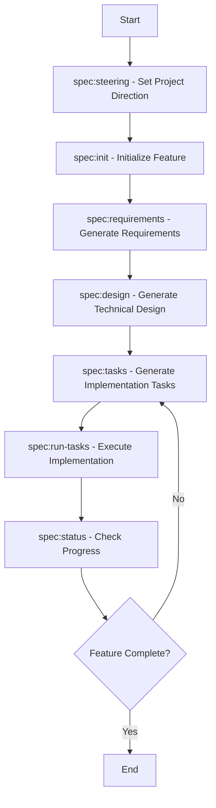
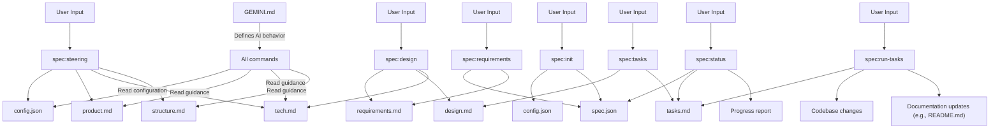

# Gemini Spec-Driven Dev Template

## ⚠️ 專案停止更新通知 / Project Discontinuation Notice

**中文**：本專案已停止更新和維護。我們強烈建議您使用更成熟且持續維護的 **[cc-sdd](https://github.com/gotalab/claude-code-spec)** 專案，這是本專案的原始啟發來源，功能更完整且支援多種 AI 開發工具。

**English**: This project has been discontinued and is no longer maintained. We strongly recommend using the more mature and actively maintained **[cc-sdd](https://github.com/gotalab/claude-code-spec)** project, which is the original inspiration for this template and offers more complete functionality with support for multiple AI development tools.

### 🚀 推薦替代方案 / Recommended Alternative

**cc-sdd** 提供：
- 🤖 **多 AI 工具支援**：Claude Code、Cursor IDE、Gemini CLI
- 🌐 **多語言支援**：12種語言（英文、日文、繁體中文、簡體中文、西班牙文、葡萄牙文、德文、法文、俄文、義大利文、韓文、阿拉伯文）
- ✨ **一鍵安裝**：`npx cc-sdd@latest`
- 📋 **完整的 AI-DLC 工作流程**：要求 → 設計 → 任務 → 實作
- 🎯 **專案記憶體**：AI 學習您的程式碼庫、模式和偏好
- 📚 **Kiro IDE 相容性**：可與 Kiro IDE 無縫整合

**cc-sdd** offers:
- 🤖 **Multi-AI Tool Support**: Claude Code, Cursor IDE, Gemini CLI
- 🌐 **Multi-Language Support**: 12 languages (English, Japanese, Traditional Chinese, Chinese, Spanish, Portuguese, German, French, Russian, Italian, Korean, Arabic)
- ✨ **One-Command Installation**: `npx cc-sdd@latest`
- 📋 **Complete AI-DLC Workflow**: Requirements → Design → Tasks → Implementation
- 🎯 **Project Memory**: AI learns your codebase, patterns, and preferences
- 📚 **Kiro IDE Compatibility**: Seamless integration with Kiro IDE

### 快速開始 / Quick Start

```bash
# 安裝 cc-sdd / Install cc-sdd
npx cc-sdd@latest

# 支援多種選項 / Multiple options supported
npx cc-sdd@latest --lang zh-TW --gemini-cli  # 繁體中文 + Gemini CLI
npx cc-sdd@latest --lang ja --cursor         # 日文 + Cursor IDE
```

了解更多請訪問：[cc-sdd GitHub Repository](https://github.com/gotalab/cc-sdd)

---

## 📚 歷史資料 / Archive Documentation

> ⚠️ **注意**：以下內容為原專案的歷史文檔，僅供參考。建議使用上述推薦的 cc-sdd 專案。
>
> **Notice**: The following content is archived documentation from the original project, provided for reference only. Please use the recommended cc-sdd project above.

> 🌐 **Language**: [English](README.md) | [繁體中文](README_zh-TW.md)

---

## English

### Quick Start

To get started with the Gemini Spec-Driven Dev Template, follow these steps:

1. **Integrate into Your Project**
   Copy the `.gemini/`, `.kiro/`, and `GEMINI.md` from this template into the root directory of your target project.

2. **(Optional) Configure Workflow**
   Edit `.kiro/config.json` to set your preferred `approval_mode` (e.g., `"implicit"` for streamlined, or `"interactive"` for explicit confirmation).

3. **Launch Gemini in Your Project Directory**
   From your project's root directory, launch Gemini via the terminal.

   ```bash
   gemini
   ```

4. **Set Project Language and Initial Steering**
   Run the recommended first step for any new project. This command initializes or updates the project's high-level goals and architecture, including setting the default language.

   ```bash
   /spec:steering
   ```

5. **Initialize Your First Feature**
   Start your first feature specification by providing a detailed description. This creates the necessary directory structure and metadata files.

   ```bash
   /spec:init "A detailed description of the feature you want to build."
   ```

---

## Table of Contents

* [Gemini Spec-Driven Dev Template](#gemini-spec-driven-dev-template)
  * [English](#english)
    * [Quick Start](#quick-start)
  * [Table of Contents](#table-of-contents)
    * [Project Overview](#project-overview)
    * [The Role of `GEMINI.md` and Multilingual Interaction](#the-role-of-geminimd-and-multilingual-interaction)
    * [Configurable Workflow](#configurable-workflow)
    * [Template Structure](#template-structure)
    * [Step-by-Step Guide](#step-by-step-guide)
    * [Effective Use of Examples](#effective-use-of-examples)
    * [Best Practices](#best-practices)
    * [Document and Configuration Relationships](#document-and-configuration-relationships)
    * [Functional Comparison with `claude-code-spec`](#functional-comparison-with-claude-code-spec)

---

### Project Overview

This project, gemini-spec-driven-dev-template, is a re-implementation and adaptation of the powerful spec-driven
development workflow from the claude-code-spec project, brought into the Gemini CLI ecosystem. Our goal is to replicate
that seamless, automated, and reliable development process using the native capabilities of the Gemini CLI, particularly
its custom commands and tool execution features.

As a starter kit and a powerful extension for the Gemini CLI, this template provides a structured, command-driven
workflow for software development. It guides you from a high-level feature idea to a detailed, and now executable,
implementation plan (via the new /spec:run-tasks command) through a series of automated steps. This ensures
consistency, quality, and clear documentation throughout the development lifecycle.

* Inspired by: [claude-code-spec](https://github.com/gotalab/claude-code-spec)

---

### The Role of `GEMINI.md` and Multilingual Interaction

This template includes a GEMINI.md file, which acts as the central brain for the AI agent. It contains a detailed set
of instructions that define the agent's behavior, workflow, and logic.

A key feature of this logic is multilingual support. The recommended entry point for language configuration is now the
/spec:steering command, which sets the project's default language stored in .kiro/config.json. All subsequent commands,
including /spec:init, will automatically read and use this setting to maintain consistent multilingual interactions.

---

### Configurable Workflow

This template now supports both implicit and interactive approval workflows. You can switch between them by editing the
.kiro/config.json file.

* `"approval_mode": "implicit"` (Default): The original, streamlined workflow where running the next command (e.g.,
  /spec:design) automatically approves the previous stage.
* `"approval_mode": "interactive"`: A more deliberate workflow where the agent will ask for your explicit [y/N]
  confirmation before proceeding to the next stage, similar to the original claude-code-spec.

---

### Template Structure

This template provides a structured environment for spec-driven development. Here's an overview of the key directories
and files:

```bash
gemini-spec-driven-dev-template/
├── .gemini/                     # Gemini CLI commands and scripts
│   ├── commands/                # Custom commands (e.g., /spec:init, /spec:design)
│   └── scripts/                 # Helper scripts (e.g., calculate_progress.py)
├── .kiro/                       # Specification files and configuration
│   ├── config.json              # Workflow configuration (e.g., approval_mode, language)
│   ├── specs/                   # Generated specification documents for features
│   │   └── [feature-name]/      # Feature-specific directory
│   │       ├── requirements.md  # Feature requirements
│   │       ├── design.md        # Technical design
│   │       ├── tasks.md         # Implementation tasks
│   │       └── spec.json        # Feature metadata
│   └── steering/                # Project-wide steering documents
│       ├── product.md           # Product goals and vision
│       ├── tech.md              # Technical standards and decisions
│       └── structure.md         # Project structure guidelines
├── example/                     # Example projects demonstrating the workflow
│   └── blog-post-generator/     # A complete, functional example project
├── GEMINI.md                    # Core instructions and behavior for the Gemini agent
├── README.md                    # This document
└── ...                          # Other project files (e.g., .gitignore, CHANGELOG.md)
```

---

### Step-by-Step Guide

Follow this sequence to develop a feature from scratch using the Gemini Spec-Driven Dev Template:

#### Workflow Overview



#### Command Reference

| Command | Purpose | Common Timing |
|---|---|---|
| `/spec:steering` | Establishes or updates the project's high-level goals, architecture, and structure, including setting the default language. | First step for any new project. |
| `/spec:init` | Creates the necessary directory structure and metadata files for a new feature. | When starting a new feature. |
| `/spec:requirements` | Generates the `requirements.md` file based on the initial feature description. | After initializing a feature. |
| `/spec:design` | Implicitly approves requirements and generates the `design.md` file. | After reviewing and approving requirements. |
| `/spec:tasks` | Implicitly approves design and generates a detailed `tasks.md` file with a TDD-style checklist for implementation. | After reviewing and approving the design. |
| `/spec:run-tasks` | Automatically executes the coding tasks defined in `tasks.md`, writing and modifying files to build the feature. | When ready to implement the feature. |
| `/spec:status` | Provides a full report on the feature's progress, including automated task completion percentage. | At any point to check progress. |

#### Phase 1: Steering & Initialization

* **0. Set Project Direction (`/spec:steering`)**: This initial command is crucial for defining the project's overarching goals and technical foundation. For new projects, it prompts for a high-level description and generates initial steering documents, also setting the project's default language.

* **0.1. Custom Steering (`/spec:steering-custom`) (Optional)**: Use this command to create specialized steering documents for specific contexts, such as API standards or testing methodologies.

* **1. Initialize Feature (`/spec:init`)**: This command sets up the necessary directory structure and metadata files for your new feature, automatically incorporating the project's language setting.

#### Phase 2: Specification Development

* **2. Generate Requirements (`/spec:requirements`)**: This command generates the `requirements.md` file, outlining the feature's functional and non-functional needs. Review this document carefully before proceeding.

* **3. Generate Design (`/spec:design`)**: This command implicitly approves the requirements and generates the `design.md` file, detailing the technical architecture and solutions. It incorporates best practices and updates project-wide technical standards.

* **4. Generate Tasks (`/spec:tasks`)**: This command implicitly approves the design and generates a detailed `tasks.md` file, providing a TDD-style checklist for the implementation phase.

#### Phase 3: Implementation & Verification

| Command | Action |
|---|---|
| `/spec:run-tasks [feature-name]` | Automatically executes the coding tasks defined in `tasks.md`, writing and modifying files to build the feature. It now also automatically generates and writes related documentation files as needed (e.g., updating README.md). |
| `/spec:status [feature-name]` | At any point, run this command to get a full report on the feature's progress. The report now includes a specific, runnable next command to guide you. |

---

### Effective Use of Examples

The example/ directory is crucial for success. The AI programming assistant performs significantly better when it can
see patterns to follow.

This template includes a fully functional and completed sample project located at:

```bash
example/blog-post-generator/
```

This project demonstrates a complete spec-driven development workflow. For detailed information and usage instructions,
please refer to the README.md file in the example project directory.

#### How to Leverage the Example Project

* **Explore**: Navigate through `example/blog-post-generator/` to understand a complete spec-driven project from requirements
    (`.kiro/specs/blog-post-generator/requirements.md`) to implementation (`src/`).
* **Learn Patterns**: Observe how the code adheres to best practices and project conventions.
* **Replicate**: Use the example as a blueprint for your own features. You can copy its structure and adapt it.
* **Test Drive**: Run the example's tests (`pytest` from `example/blog-post-generator/`) to see a working implementation.

---

### Best Practices

* **Follow the Workflow**: Adhere to the `init` -> `requirements` -> `design` -> `tasks` sequence for consistent results.
* **Steer First**: Run `/spec:steering` for new projects to establish a clear foundation.
* **Review and Refine**: Manually review and edit generated documents (`requirements.md`, `design.md`, `tasks.md`) to ensure they align with your vision.
* **Leverage Examples**: Use the `example/` directory to understand best practices and provide the AI with clear patterns to follow.

---

### Document and Configuration Relationships

Understanding how different files and configurations interact is key to effectively using this template.

#### Document Relationship Diagram



* **`GEMINI.md`**: The core instruction file for the Gemini agent, defining its behavior, workflow, and logic. It is the agent’s “brain.”
* **`.kiro/config.json`**: Stores project-wide configurations, including approval_mode (implicit/interactive) and the default language for new features.
* **`.kiro/steering/`**: Contains project-level guidance documents (product.md, tech.md, structure.md) defining the project’s vision, technical standards, and architecture guidelines. These are your project’s “constitution.”
* **`.kiro/specs/[feature-name]/`**: This directory contains all generated specification files (requirements.md, design.md, tasks.md) and metadata (spec.json) for a specific feature. These are your feature’s “blueprints.”
* **`example/`**: Contains fully functional example projects demonstrating the spec-driven workflow and providing the AI with learnable code patterns.

---

## Functional Comparison with `claude-code-spec`

### Progress Tracking

* `claude-code-spec`: Uses event-driven **Hooks** to automatically trigger progress updates in the background after a file is modified. This is a **proactive, push-based** system.
* This Project (Gemini): Implements progress tracking via the `/spec:status` command. When executed, it calls a Python script (`calculate_progress.py`) on-demand to calculate progress without modifying `spec.json`, presenting the real-time status directly.

### Spec Drift Detection

* `claude-code-spec`: Relies on Hooks to trigger LLM analysis in the background when source code changes, providing real-time feedback.
* This Project (Gemini): This feature is not yet supported.
