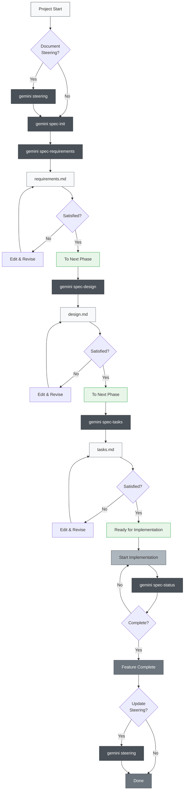
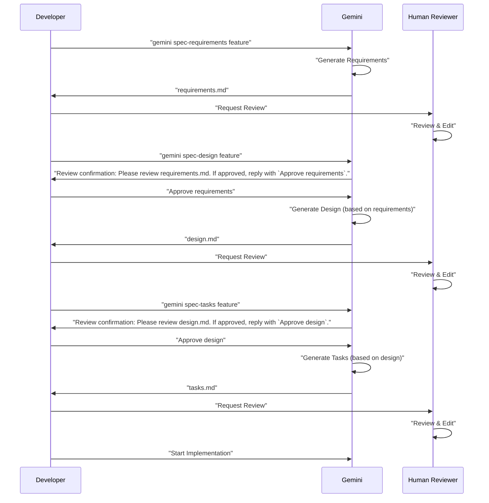

# Gemini Spec-Driven Development Template

This is a template for setting up a spec-driven development workflow with Gemini.

## Overview

This template provides a structured approach to software development using Gemini, based on the concept of spec-driven development. It helps ensure that development is aligned with product goals, technical architecture, and project conventions.

## Getting Started

### Step 0: Project Setup (One-time)

1.  **Copy Configuration**: Copy the `.gemini/` directory and its contents to your project's root directory.
    ```bash
    cp -r /path/to/gemini-spec-driven-dev-template/.gemini/ .
    ```
2.  **Create Kiro Directories**: Create the `.kiro/steering` and `.kiro/specs` directories in your project's root.
    ```bash
    mkdir -p .kiro/steering .kiro/specs
    ```
3.  **Create Steering Documents**: These foundational documents guide Gemini's understanding of your project. **It is highly recommended to use the `gemini steering` command to generate these files**, as it intelligently analyzes your project and populates them with initial content.
    ```bash
    gemini steering
    ```
    Alternatively, you can create empty files and fill them manually:
    - `product.md`: Defines product goals, target users, and core value.
    - `tech.md`: Defines the tech stack, architecture, and development environment.
    - `structure.md`: Defines the project's directory structure and code organization conventions.
    ```bash
    touch .kiro/steering/product.md .kiro/steering/tech.md .kiro/steering/structure.md
    ```

### Development Workflow Example: Adding a "User Login" Feature

#### Step 1: Initialize the Spec

- **Your Command**: `gemini spec-init "User Login Feature"`
- **Gemini's Action**: Creates the necessary files and directories for the new feature spec.

#### Step 2: Define Requirements

- **Your Command**: `gemini spec-requirements "User Login Feature" "As a user, I want to log in with my email and password."`
- **Gemini's Action**: Fills in the `requirements.md` file.
- **Your Approval**: `Approve requirements`

#### Step 3: Generate Technical Design

- **Your Command**: `gemini spec-design "User Login Feature"`
- **Gemini's Action**: Generates the technical design in `design.md`.
- **Your Approval**: `Approve design`

#### Step 4: Generate Implementation Tasks

- **Your Command**: `gemini spec-tasks "User Login Feature"`
- **Gemini's Action**: Creates a task list in `tasks.md`.
- **Your Approval**: `Approve tasks`

#### Step 5: Implementation

- **Your Command**: `cat .kiro/specs/User-Login-Feature/tasks.md` (to view tasks)
- **Your Command**: `gemini "Implement the first task: ..."`

## Spec-Driven Development Process

### Process Flow Diagram

This flow requires "Review & Approval" at each phase.

**Steering documents** are documents that record persistent knowledge about the project (architecture, tech stack, code conventions, etc.). Creating and updating them is optional but recommended for long-term maintainability of the project.



### 3-Phase Approval Workflow

The core of this system requires human review and approval at each phase:



## Best Practices

### ✅ Recommendations

1.  **Always start with steering**
    - Use `gemini steering` for all scenarios (intelligently handles both creation and updates)
    - The unified command protects existing files while handling them appropriately

2.  **Don't skip phases**
    - Strictly follow the order: Requirements → Design → Tasks
    - Ensure human review at each phase

3.  **Regular progress checks**
    - Use `gemini spec-status` to understand current situation
    - Update task completion status appropriately

4.  **Maintain steering**
    - Run `gemini steering` after major changes (automatically determines update strategy)
    - Update as the project grows

### ❌ Things to Avoid

1.  **Moving to next phase without approval**
    - Don't forget to respond to confirmation prompts

2.  **Neglecting steering documents**
    - Outdated information hinders development

3.  **Not updating task status**
    - Progress becomes unclear and management becomes difficult

## Project Structure

```
.
├── .gemini/
│   ├── commands/          # Gemini command definitions
│   │   ├── spec-init.md
│   │   ├── spec-requirements.md
│   │   ├── spec-design.md
│   │   ├── spec-tasks.md
│   │   ├── spec-status.md
│   │   ├── steering.md          # Unified steering command
│   │   └── steering-custom.md
│   └── settings.json
├── .kiro/
│   ├── steering/          # Steering documents
│   │   ├── product.md
│   │   ├── tech.md
│   │   └── structure.md
│   └── specs/             # Feature specifications
│       └── [feature-name]/
│           ├── spec.json      # Phase approval status
│           ├── requirements.md # Requirements document
│           ├── design.md      # Technical design document
│           └── tasks.md       # Implementation tasks
├── docs/
│   ├── architecture.md
│   ├── index.md
│   └── usage.md
├── README.md              # English version README
├── README.zh-TW.md        # Traditional Chinese version README
└── (your project files)
```

## Automation Features (Simulated)

Gemini simulates automation through interactive approvals and file updates:

-   **Task Progress Tracking**: Manually update `tasks.md` checkboxes. `gemini spec-status` will parse and report progress.
-   **Specification Compliance Checking**: Gemini will check `spec.json` for phase approvals before proceeding to the next stage.
-   **Context Preservation**: Gemini will always refer to the `.kiro/steering/` and `.kiro/specs/` documents for context.
-   **Steering Drift Detection**: The `gemini steering` command will analyze the project and suggest updates to steering documents.

## Troubleshooting

### When commands don't work
1.  Check existence of `.gemini/commands/` directory.
2.  Verify command file naming convention (`command-name.md`).
3.  Ensure you are in the correct project directory.

### When stuck in approval flow
1.  Check that you're responding correctly to review confirmation prompts (e.g., `Approve requirements`).
2.  Verify previous phase approval is complete by checking `spec.json`.
3.  Use `gemini spec-status <feature_name>` to diagnose current state.
4.  Manually check/edit `spec.json` if needed.

## Command Summary

- `gemini steering`: Analyzes the project and generates steering documents.
- `gemini steering-custom`: Creates custom steering documents for specialized contexts.
- `gemini spec-init <feature_name>`: Initializes a new feature spec.
- `gemini spec-requirements <feature_name> "<description>"`: Generates requirements.
- `gemini spec-design <feature_name>`: Generates the technical design.
- `gemini spec-tasks <feature_name>`: Generates implementation tasks.
- `gemini spec-status <feature_name>`: Shows current status and progress for a feature.
