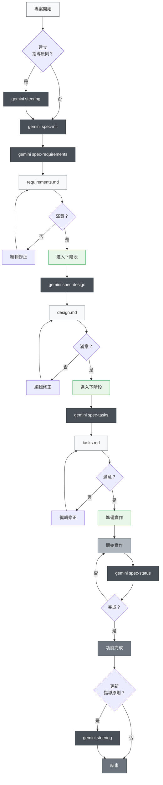
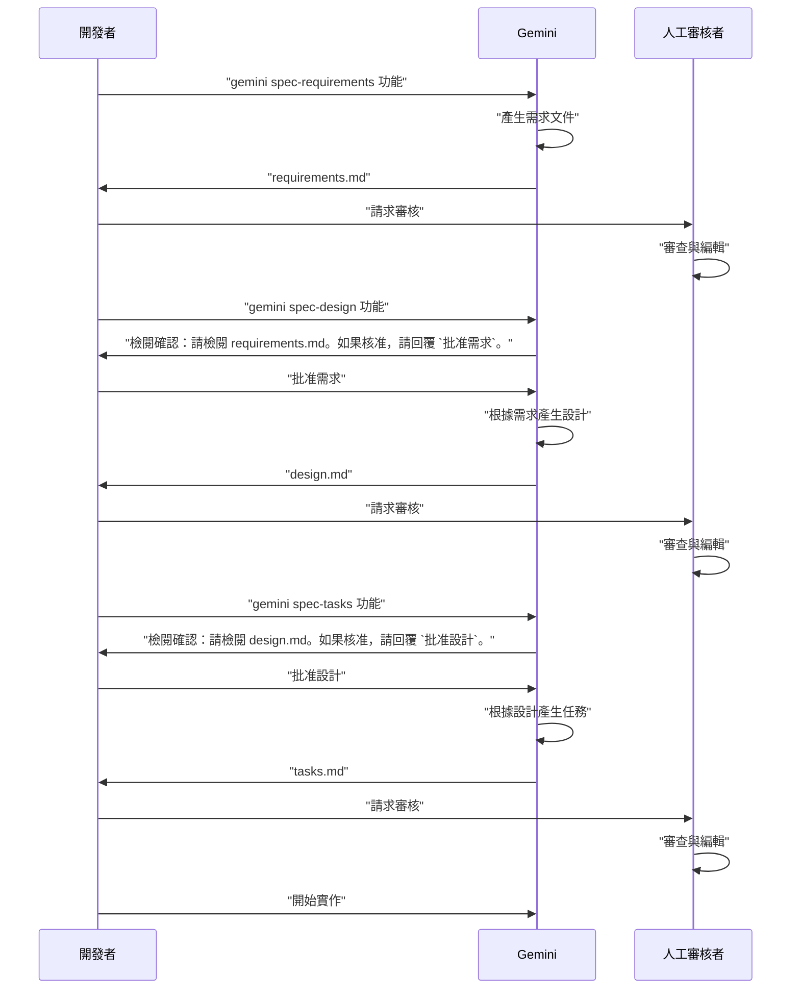

# Gemini 規格驅動開發模板

這是一個使用 Gemini 設定規格驅動開發流程的模板。

## 總覽

此模板提供了一個使用 Gemini 進行軟體開發的結構化方法，其基礎是規格驅動開發的概念。它有助於確保開發過程與產品目標、技術架構和專案慣例保持一致。

## 開始使用

### 第零步：專案設定 (一次性)

1.  **複製設定檔**：將 `.gemini/` 目錄及其所有內容，從 `gemini-spec-driven-dev-template` 複製到您專案的根目錄。
    ```bash
    cp -r /path/to/gemini-spec-driven-dev-template/.gemini/ .
    ```
2.  **建立 Kiro 目錄**：在您的專案根目錄下，建立 `.kiro/steering` 和 `.kiro/specs` 這兩個目錄。
    ```bash
    mkdir -p .kiro/steering .kiro/specs
    ```
3.  **建立指導原則文件**：這些基礎文件指導 Gemini 對您專案的理解。**強烈建議使用 `gemini steering` 指令來產生這些檔案**，因為它會智慧地分析您的專案並用初始內容填充它們。
    ```bash
    gemini steering
    ```
    或者，您可以手動建立空檔案並填寫它們：
    - `product.md`：定義產品目標、目標使用者和核心價值。
    - `tech.md`：定義專案的技術棧、架構和開發環境。
    - `structure.md`：定義專案的目錄結構和程式碼組織慣例。
    ```bash
    touch .kiro/steering/product.md .kiro/steering/tech.md .kiro/steering/structure.md
    ```

### 開發流程範例：新增「使用者登入」功能

#### 第一階段：初始化規格

-   **您的指令**：`gemini spec-init "使用者登入功能"`
-   **Gemini 的執行過程**：為新功能規格建立必要的檔案和目錄。

#### 第二階段：定義需求

-   **您的指令**：`gemini spec-requirements "使用者登入功能" "作為一個已註冊的使用者，我希望能使用我的電子郵件和密碼登入，以便存取我的帳戶。"`
-   **Gemini 的執行過程**：填寫 `requirements.md` 檔案。
-   **您的批准**：`批准需求`

#### 第三階段：產生技術設計

-   **您的指令**：`gemini spec-design "使用者登入功能"`
-   **Gemini 的執行過程**：在 `design.md` 中產生技術設計。
-   **您的批准**：`批准設計`

#### 第四階段：產生實作任務

-   **您的指令**：`gemini spec-tasks "使用者登入功能"`
-   **Gemini 的執行過程**：在 `tasks.md` 中建立任務清單。
-   **您的批准**：`批准任務`

#### 第五階段：實作

-   **您的指令**：`cat .kiro/specs/使用者登入功能/tasks.md` (查看任務)
-   **您的指令**：`gemini "實作第一個任務：..."`

## 規格驅動開發流程

### 流程圖

此流程在每個階段都需要「審查與核准」。

**指導原則文件**：記錄專案持久知識（架構、技術棧、程式規範等），建立與維護指導原則文件雖非強制，但對長期維護極有幫助。



### 三階段審核流程

本系統核心為每個階段都需人工審核與核准：



## 最佳實踐

### ✅ 建議事項

1.  **務必從指導原則開始**
    - 所有情況都使用 `gemini steering`（智慧處理新建和更新）
    - 統一指令會適當保護現有文件並妥善處理

2.  **不可跳過階段**
    - 嚴格遵循：需求 → 設計 → 任務
    - 每階段都需人工審核

3.  **定期檢查進度**
    - 用 `gemini spec-status` 掌握現況
    - 任務完成狀態要及時更新

4.  **維護指導原則文件**
    - 重大變更後執行 `gemini steering`（自動判斷更新策略）
    - 隨專案成長持續更新

### ❌ 避免事項

1.  **未核准就進入下一階段**
    - 務必回應確認提示

2.  **忽略指導原則文件**
    - 過時資訊會阻礙開發

3.  **未更新任務狀態**
    - 進度不明，管理困難

## 專案結構

```
.
├── .gemini/
│   ├── commands/          # Gemini 指令定義
│   │   ├── spec-init.md
│   │   ├── spec-requirements.md
│   │   ├── spec-design.md
│   │   ├── spec-tasks.md
│   │   ├── spec-status.md
│   │   ├── steering.md          # 統一指導原則指令
│   │   └── steering-custom.md
│   └── settings.json
├── .kiro/
│   ├── steering/          # 指導原則文件
│   │   ├── product.md
│   │   ├── tech.md
│   │   └── structure.md
│   └── specs/             # 功能規格
│       └── [feature-name]/
│           ├── spec.json      # 階段核准狀態
│           ├── requirements.md # 需求文件
│           ├── design.md      # 技術設計文件
│           └── tasks.md       # 實作任務
├── docs/
│   ├── architecture.md
│   ├── index.md
│   └── usage.md
├── README.md              # 英文版 README
├── README.zh-TW.md        # 繁體中文版 README
└── (你的專案檔案)
```

## 自動化功能 (模擬)

Gemini 透過互動式核准和檔案更新來模擬自動化：

-   **任務進度追蹤**：手動更新 `tasks.md` 核取方塊。`gemini spec-status` 將解析並報告進度。
-   **規格符合性檢查**：Gemini 將在進入下一階段之前檢查 `spec.json` 中的階段核准。
-   **上下文保留**：Gemini 將始終參考 `.kiro/steering/` 和 `.kiro/specs/` 文件以獲取上下文。
-   **指導原則漂移偵測**：`gemini steering` 指令將分析專案並建議更新指導原則文件。

## 疑難排解

### 指令無法運作時
1.  檢查 `.gemini/commands/` 目錄是否存在。
2.  確認指令檔案命名規則（`command-name.toml`）。
3.  確保您在正確的專案目錄中。

### 卡在審核流程時
1.  確認您是否正確回應檢閱確認提示（例如，`批准需求`）。
2.  透過檢查 `spec.json` 確認前一階段的核准是否已完成。
3.  使用 `gemini spec-status <功能名稱>` 來診斷目前狀態。
4.  必要時手動檢查/編輯 `spec.json`。

## 指令摘要

- `gemini steering`: 分析專案並產生指導原則文件。
- `gemini steering-custom`: 為特定情境建立自訂指導原則文件。
- `gemini spec-init <功能名稱>`：初始化新功能的規格。
- `gemini spec-requirements <功能名稱> "<需求描述>"`：產生功能的需求文件。
- `gemini spec-design <功能名稱>`：產生功能的技術設計文件。
- `gemini spec-tasks <功能名稱>`：產生功能的實作任務清單。
- `gemini spec-status <功能名稱>`：顯示功能的目前狀態和進度。
