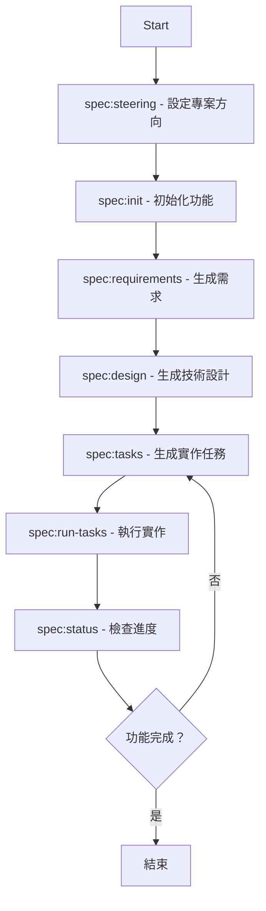
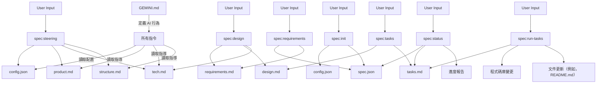

# Gemini 規格驅動開發範本

> 🌐 **Language**: [English](README.md) | [繁體中文](README_zh-TW.md)

---

## 繁體中文

### 快速開始

要開始使用 Gemini 規格驅動開發範本，請遵循以下步驟：

1. **整合到您的專案中**
   將 `.gemini/`、`.kiro/` 和 `GEMINI.md` 從此範本複製到您的目標專案的根目錄。

2. **（可選）配置工作流程**
   編輯 `.kiro/config.json` 以設定您偏好的 `approval_mode`（例如，`"implicit"` 用於簡化，或 `"interactive"` 用於明確確認）。

3. **於專案目錄啟動Gemini**
   透過終端機，從您的目標專案的根目錄啟動 Gemini。

   ```bash
   gemini
   ```

4. **設定專案語言和初始指導**
   運行任何新專案的推薦第一步。此命令初始化或更新專案的高層次目標和架構，包括設定預設語言。

   ```bash
   /spec:steering
   ```

5. **初始化您的第一個功能**
   透過提供詳細描述來啟動您的第一個功能規格。這將創建必要的目錄結構和元數據檔案。

   ```bash
   /spec:init "在這裡詳細描述您想建立的功能。"
   ```

## 目錄

* [Gemini 規格驅動開發範本](#gemini-規格驅動開發範本)
  * [繁體中文](#繁體中文)
    * [快速開始](#快速開始)
  * [目錄](#目錄)
    * [專案簡介](#專案簡介)
    * [`GEMINI.md` 的角色與多語言互動](#geminimd-的角色與多語言互動)
    * [可配置的工作流程](#可配置的工作流程)
    * [模板結構](#模板結構)
    * [步驟指南](#步驟指南)
    * [有效使用範例](#有效使用範例)
    * [最佳實踐](#最佳實踐)
    * [文件與配置關係](#文件與配置關係)
  * [各階段功能及與 `claude-code-spec` 的差異](#各階段功能及與-claude-code-spec-的差異)

---

### 專案簡介

本專案 `gemini-spec-driven-dev-template` 是 `claude-code-spec` 專案中強大規格驅動開發工作流程的重新實現和改編，並將其引入 Gemini CLI 生態系統。我們的目標是利用 Gemini CLI 的原生功能，特別是其自訂命令和工具執行功能，來複製那種無縫、自動化和可靠的開發過程。

作為 Gemini CLI 的入門套件和強大擴展，此範本提供了一個結構化的、命令驅動的軟體開發工作流程。它引導您從高層次的功能構想，透過一系列自動化步驟，產出一個詳細且現在可執行的實作計畫（透過新的 `/spec:run-tasks` 命令）。這確保了整個開發生命週期中的一致性、品質和清晰的文件。

* 靈感來源：[claude-code-spec](https://github.com/gotalab/claude-code-spec)

---

### `GEMINI.md` 的角色與多語言互動

此範本包含一個 `GEMINI.md` 檔案，它充當 AI 代理的核心大腦。它包含一組詳細的指令，定義了代理的行為、工作流程和邏輯。

此邏輯的一個關鍵特性是多語言支援。語言配置的推薦入口點現在是 `/spec:steering` 命令，它設定並儲存專案的預設語言到 `.kiro/config.json`。所有後續命令，包括 `/spec:init`，都將自動讀取並使用此設定以保持一致的多語言互動。

---

### 可配置的工作流程

此範本現在支援隱式和互動式兩種審批工作流程。您可以透過編輯 `.kiro/config.json` 檔案來切換它們。

* `"approval_mode": "implicit"` (預設)：原始的、簡化的工作流程，運行下一個命令（例如 `/spec:design`）會自動批准上一個階段。
* `"approval_mode": "interactive"`：一個更深思熟慮的工作流程，代理將在進入下一個階段之前，要求您明確的 `[y/N]` 確認，類似於原始的 `claude-code-spec`。

---

### 模板結構

此範本為規格驅動開發提供了一個結構化的環境。以下是關鍵目錄和檔案的概述：

```bash
gemini-spec-driven-dev-template/
├── .gemini/                     # Gemini CLI 命令和腳本
│   ├── commands/                # 自訂命令（例如，/spec:init, /spec:design）
│   └── scripts/                 # 輔助腳本（例如，calculate_progress.py）
├── .kiro/                       # 規格檔案和配置
│   ├── config.json              # 工作流程配置（例如，approval_mode, language）
│   ├── specs/                   # 為功能生成的規格文件
│   │   └── [feature-name]/      # 功能特定目錄
│   │       ├── requirements.md  # 功能需求
│   │       ├── design.md        # 技術設計
│   │       ├── tasks.md         # 實作任務
│   │       └── spec.json        # 功能元數據
│   └── steering/                # 專案範圍的指導文件
│       ├── product.md           # 產品目標和願景
│       ├── tech.md              # 技術標準和決策
│       └── structure.md         # 專案結構指南
├── example/                     # 演示工作流程的範例專案
│   └── blog-post-generator/     # 一個完整、功能齊全的範例專案
├── GEMINI.md                    # Gemini 代理的核心指令和行為
├── README.md                    # 此文件
└── ...                          # 其他專案檔案（例如，.gitignore, CHANGELOG.md）
```

---

### 步驟指南

請遵循以下順序，使用 Gemini 規格驅動開發範本從頭開始開發一個功能：

#### 工作流程概述



#### 指令參考

| 指令 | 用途 | 常見時機 |
|---|---|---|
| `/spec:steering` | 設定專案高層次目標、架構和結構，包括設定預設語言。 | 任何新專案的第一步。 |
| `/spec:init` | 為新功能建立必要的目錄結構和元數據檔案。 | 開發新功能時。 |
| `/spec:requirements` | 根據初始功能描述生成 `requirements.md` 檔案。 | 初始化功能後。 |
| `/spec:design` | 隱式批准需求並生成 `design.md` 檔案。 | 審閱並批准需求後。 |
| `/spec:tasks` | 隱式批准設計並生成帶有 TDD 風格檢查清單的詳細 `tasks.md` 檔案。 | 審閱並批准設計後。 |
| `/spec:run-tasks` | 自動執行 `tasks.md` 中定義的編碼任務，寫入和修改檔案以構建功能。 | 準備實作功能時。 |
| `/spec:status` | 提供功能進度的完整報告，包括自動化任務完成百分比。 | 隨時檢查進度。 |

#### 階段 1：指導與初始化

* **0. 設定專案方向 (`/spec:steering`)**: 此初始命令對於定義專案的總體目標和技術基礎至關重要。對於新專案，它會提示高層次描述並生成初始指導文件，同時設定專案的預設語言。

* **0.1. 自訂指導 (`/spec:steering-custom`) (可選)**: 使用此命令為特定情境（例如，API 標準、測試方法）建立專門的指導文件。

* **1. 初始化功能 (`/spec:init`)**: 此命令會為您的新功能建立必要的目錄結構和元數據檔案，並自動納入專案的語言設定。

#### 階段 2：規格開發

* **2. 生成需求 (`/spec:requirements`)**: 此命令會生成 `requirements.md` 檔案，概述功能的職能和非職能需求。在繼續之前請仔細審閱此文件。

* **3. 生成設計 (`/spec:design`)**: 此命令會隱式批准需求並生成 `design.md` 檔案，詳細說明技術架構和解決方案。它會整合最佳實踐並更新專案範圍的技術標準。

* **4. 生成任務 (`/spec:tasks`)**: 此命令會隱式批准設計並生成一個詳細的 `tasks.md` 檔案，為實作階段提供 TDD 風格的檢查清單。

#### 階段 3：實作與驗證

| 命令 | 作用 |
|---|---|
| `/spec:run-tasks [feature-name]` | 自動執行 `tasks.md` 中定義的編碼任務，寫入和修改檔案以構建功能。它現在還會自動生成和寫入相關的文件（例如，更新 `README.md`）。 |
| `/spec:status [feature-name]` | 在任何時候，運行此命令以獲取功能進度的完整報告。報告現在包含一個特定的、可運行的下一個命令來指導您。 |

---

### 有效使用範例

`example/` 目錄對於成功至關重要。當 AI 程式設計助理能夠看到要遵循的模式時，它的表現會顯著提高。

此範本包含一個功能齊全且已完成的範例專案，位於：

```bash
example/blog-post-generator/
```

此專案演示了一個完整的規格驅動開發工作流程。有關詳細資訊和使用說明，請參閱範例專案目錄中的 `README.md` 檔案。

#### 如何利用範例專案

* **探索**: 瀏覽 `example/blog-post-generator/` 以了解一個完整的規格驅動專案，從需求
    （`.kiro/specs/blog-post-generator/requirements.md`）到實作（`src/`）。
* **學習模式**: 觀察程式碼如何遵循最佳實踐和專案慣例。
* **複製**: 將範例作為您自己功能的藍圖。您可以複製其結構並進行調整。
* **測試驅動**: 運行範例的測試（來自 `example/blog-post-generator/` 的 `pytest`）以查看工作實作。

---

### 最佳實踐

* **遵循工作流程**: 嚴格遵守 `init` -> `requirements` -> `design` -> `tasks` 的順序，以確保結果的一致性。
* **先指導，後開發**: 對於新專案，首先運行 `/spec:steering`，建立清晰的基礎。
* **審查與優化**: 手動審查和編輯生成的文件（`requirements.md`, `design.md`, `tasks.md`），確保它們與您的願景一致。
* **善用範例**: 使用 `example/` 目錄來理解最佳實踐，並為 AI 提供清晰的模式以供遵循。

---

### 文件與配置關係

了解不同檔案和配置如何互動是有效使用此範本的關鍵。

#### 文件關係圖



* **`GEMINI.md`**: Gemini 代理的核心指令檔案，定義其行為、工作流程和邏輯。它是代理的「大腦」。
* **`.kiro/config.json`**: 儲存專案範圍的配置，包括 `approval_mode`（隱式/互動式）和新功能的預設 `language`。
* **`.kiro/steering/`**: 包含專案級別的指導文件（`product.md`、`tech.md`、`structure.md`），定義專案的願景、技術標準和架構指南。這些是您專案的「憲法」。
* **`.kiro/specs/[feature-name]/`**: 此目錄包含特定功能的所有生成的規格文件（`requirements.md`、`design.md`、`tasks.md`）和元數據（`spec.json`）。這些是您功能的「藍圖」。
* **`example/`**: 包含功能齊全的範例專案，演示規格驅動工作流程並為 AI 提供可學習的程式碼模式。

---

## 各階段功能及與 `claude-code-spec` 的差異

### 進度追蹤

* `claude-code-spec`: 使用事件驅動的 **Hooks**，在檔案被修改後自動在背景觸發進度更新。這是一個**主動、推播式**系統。
* 本專案 (Gemini): 透過 `/spec:status` 指令實現進度追蹤。執行時會按需呼叫 Python 腳本 (`calculate_progress.py`) 計算進度，不修改 `spec.json`，直接呈現即時狀態。

### 規格漂移檢測

* `claude-code-spec`: 依賴 Hooks，在原始碼變更時背景觸發 LLM 分析，提供即時回饋。
* 本專案 (Gemini): 目前尚未支援此功能。
