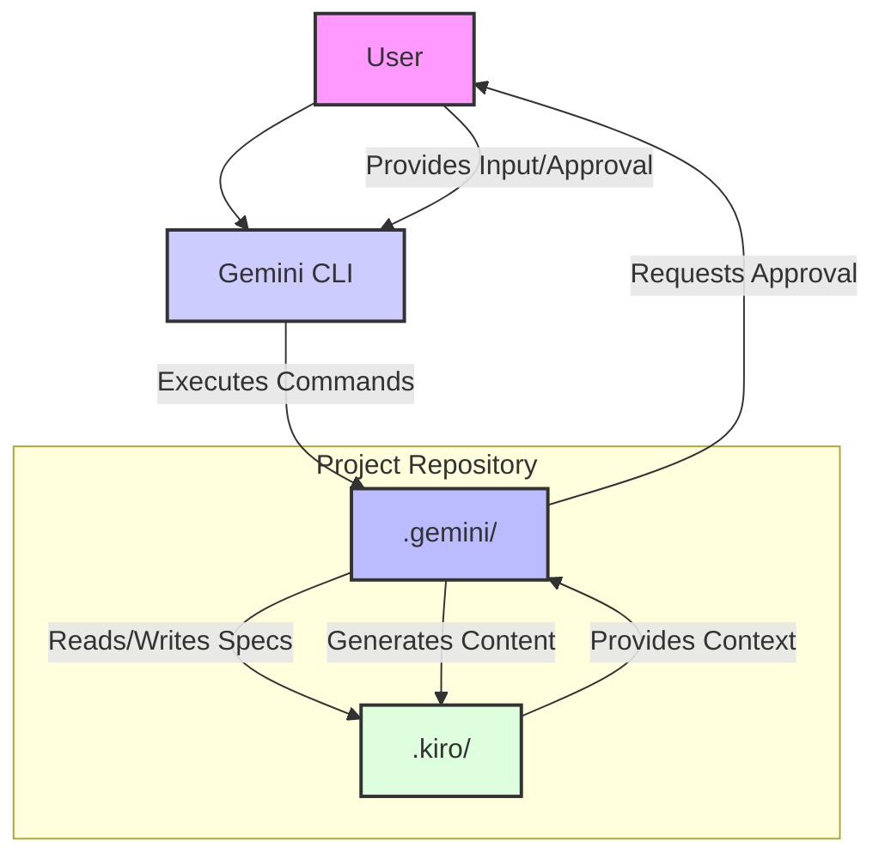

# Architecture

This document explains the architecture of the Gemini Spec-Driven Development framework.

## Overview

The Gemini Spec-Driven Development framework is designed to provide a structured and guided approach to software development, leveraging Gemini's capabilities to assist in various phases. Its architecture is modular, allowing for clear separation of concerns and easy integration into existing projects.

## Core Components

### 1. `.kiro/` Directory

This directory serves as the central repository for project knowledge and feature specifications, mirroring the Kiro IDE's approach to living documentation.

-   **`steering/`**: Contains the foundational steering documents (`product.md`, `tech.md`, `structure.md`). These Markdown files act as the project's guiding principles, providing Gemini with essential context about the product goals, technology stack, and project conventions. They are crucial for ensuring consistency and alignment throughout the development process.

-   **`specs/`**: Stores the detailed specifications for each feature under development. Each feature gets its own subdirectory (e.g., `specs/user-login-feature/`), containing:
    -   `spec.json`: Metadata for the feature, including its current phase, approval status for requirements, design, and tasks, and other relevant information.
    -   `requirements.md`: The detailed requirements document, often in EARS format, outlining user stories and acceptance criteria.
    -   `design.md`: The technical design document, describing the architecture, data models, API endpoints, and implementation strategy.
    -   `tasks.md`: A breakdown of implementation tasks, typically in a checklist format, guiding the coding phase.

### 2. `.gemini/` Directory

This directory houses the Gemini-specific configuration and command definitions that enable the structured workflow.

-   **`commands/`**: Contains Markdown files that define custom Gemini commands (e.g., `spec-init.md`, `spec-requirements.md`, `steering.md`). These files act as templates, guiding Gemini on how to execute specific development tasks, including the steps to take, the information to gather, and the files to create or modify.

-   **`settings.json`**: The main configuration file for the Gemini framework within the project. It maps command names to their respective template files and can include other global settings for the framework.

### 3. `docs/` Directory

This directory contains the comprehensive documentation for the Gemini Spec-Driven Development framework itself, guiding users on how to set up, use, and extend the system.

-   **`architecture.md` (This file)**: Explains the overall structure and interaction of the framework's components.
-   **`index.md`**: Provides a high-level introduction to the framework.
-   **`usage.md`**: Details the step-by-step workflow and command usage.

### 4. Interaction Flow (Conceptual Diagram)

## Key Principles Reflected in Architecture

-   **Documentation as Code**: All project knowledge and specifications are stored as version-controlled Markdown and JSON files.
-   **Human-in-the-Loop**: Critical approval steps are explicitly designed for human review and decision-making.
-   **Modularity**: Components are separated into distinct directories (`.kiro/`, `.gemini/`, `docs/`) for clarity and maintainability.
-   **Context-Driven**: Gemini's actions are heavily influenced by the content of the steering and spec documents, ensuring alignment with project goals.
