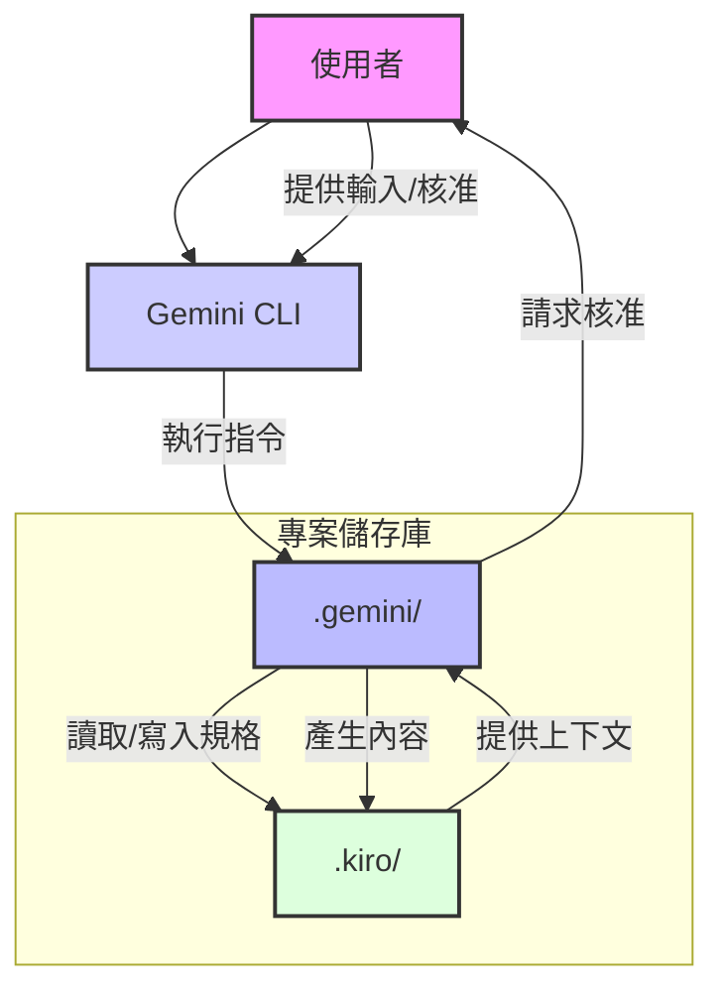

# 架構

本文件說明 Gemini 規格驅動開發框架的架構。

## 總覽

Gemini 規格驅動開發框架旨在提供一個結構化且有指導的軟體開發方法，利用 Gemini 的能力協助各個階段。其架構是模組化的，便於清晰地分離關注點並輕鬆整合到現有專案中。

## 核心元件

### 1. `.kiro/` 目錄

此目錄作為專案知識和功能規格的中央儲存庫，反映了 Kiro IDE 的「活文件」方法。

-   **`steering/`**: 包含基礎的指導原則文件 (`product.md`, `tech.md`, `structure.md`)。這些 Markdown 檔案作為專案的指導原則，為 Gemini 提供關於產品目標、技術棧和專案慣例的基本上下文。它們對於確保整個開發過程中的一致性和對齊至關重要。

-   **`specs/`**: 儲存開發中每個功能的詳細規格。每個功能都有自己的子目錄（例如 `specs/user-login-feature/`），其中包含：
    -   `spec.json`: 功能的元數據，包括其當前階段、需求、設計和任務的批准狀態，以及其他相關資訊。
    -   `requirements.md`: 詳細的需求文件，通常採用 EARS 格式，概述使用者故事和驗收標準。
    -   `design.md`: 技術設計文件，描述架構、資料模型、API 端點和實作策略。
    -   `tasks.md`: 實作任務的分解，通常以清單格式呈現，指導編碼階段。

### 2. `.gemini/` 目錄

此目錄包含 Gemini 特定的設定和指令定義，以啟用結構化的工作流程。

-   **`commands/`**: 包含定義自訂 Gemini 指令的 Markdown 檔案（例如 `spec-init.md`, `spec-requirements.md`, `steering.md`）。這些檔案作為模板，指導 Gemini 如何執行特定的開發任務，包括要採取的步驟、要收集的資訊以及要建立或修改的檔案。

-   **`settings.json`**: 專案中 Gemini 框架的主要設定檔。它將指令名稱映射到其各自的模板檔案，並可以包含框架的其他全域設定。

### 3. `docs/` 目錄

此目錄包含 Gemini 規格驅動開發框架本身的綜合說明文件，指導使用者如何設定、使用和擴展系統。

-   **`architecture.md` (本檔案)**: 解釋框架元件的整體結構和互動。
-   **`index.md`**: 提供框架的高層次介紹。
-   **`usage.md`**: 詳細說明逐步工作流程和指令使用方式。

### 4. 互動流程 (概念圖)

## 架構中反映的關鍵原則

-   **文件即程式碼**: 所有專案知識和規格都以版本控制的 Markdown 和 JSON 檔案形式儲存。
-   **人機協作**: 關鍵的核准步驟明確設計用於人工審查和決策。
-   **模組化**: 元件被分離到不同的目錄中（`.kiro/`, `.gemini/`, `docs/`），以提高清晰度和可維護性。
-   **上下文驅動**: Gemini 的行動受到指導原則和規格文件內容的嚴重影響，確保與專案目標保持一致。