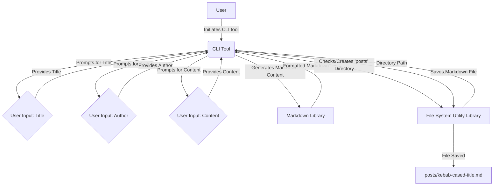

# Design: blog-post-generator

## 1. Architecture Overview

The `blog-post-generator` will be a command-line interface (CLI) tool implemented in **Python**. It will operate as a standalone script, taking user input via standard input/output. It will utilize a **Markdown library** for robust Markdown file generation and a **utility library for file system operations** to manage the creation of the 'posts' directory and saving of the generated Markdown files.

## 2. Data Flow Diagram

## 3. Component Breakdown

*   **`main.py` (CLI Entry Point)**:
    *   Handles command-line argument parsing (if any, for future extensions).
    *   Orchestrates the prompting for user input (title, author, content).
    *   Calls functions for Markdown generation and file saving.
*   **`markdown_generator.py`**:
    *   Contains functions to construct the Markdown content, including the header with metadata (title, author, date).
    *   Utilizes a chosen Markdown library (e.g., `markdown-it-py` or similar if available for Python, otherwise string formatting with careful adherence to Markdown spec).
*   **`file_manager.py`**:
    *   Contains functions for file system operations:
        *   Checking for and creating the 'posts' directory.
        *   Generating kebab-cased filenames from titles.
        *   Saving the Markdown content to the specified file path.
    *   Utilizes a chosen file system utility library (e.g., `pathlib` for object-oriented paths, or `shutil` for higher-level file operations, or a dedicated third-party library if needed).

## 4. Data Schema / ERD

No complex data schema or ERD is required as the tool primarily processes and stores flat Markdown files. The "data" is the content of the blog post itself.

**Blog Post Metadata (within Markdown header):**
*   `title`: String
*   `author`: String
*   `date`: Date (YYYY-MM-DD format)

## 5. Security Considerations

*   **Input Sanitization**: While Markdown itself is relatively safe, if the content were ever rendered in a web context, proper sanitization would be crucial to prevent XSS attacks. For a pure CLI tool generating local files, this is less of a concern, but still good practice to be aware of.
*   **File System Permissions**: The tool will create files and directories. It should operate with the minimum necessary permissions to avoid unintended system-wide changes.
*   **Path Traversal**: Ensure that user-provided input (e.g., title) cannot be used to construct malicious file paths outside the intended 'posts' directory. Kebab-casing and strict filename generation will mitigate this.

## 6. Testing Strategy

*   **Unit Tests**:
    *   `markdown_generator.py`: Test functions for correct Markdown header generation and content formatting.
    *   `file_manager.py`: Test functions for correct directory creation, filename generation (kebab-casing), and file saving.
*   **Integration Tests**:
    *   Test the `main.py` script's interaction with `markdown_generator.py` and `file_manager.py` to ensure the end-to-end flow of prompting, generation, and saving works correctly.
*   **End-to-End Tests**:
    *   Run the CLI tool as a separate process, provide simulated user input, and verify that the correct Markdown file is created in the 'posts' directory with the expected content and filename.
    *   Test edge cases: empty inputs, special characters in title, existing 'posts' directory, etc.